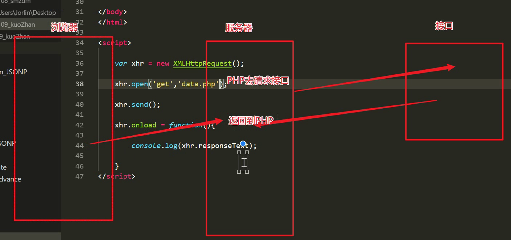

# 02AJAX关于跨域
> 浏览器限制的,浏览器出于安全角度考虑,不支持跨域访问

JavaScript中出现不能访问跨域时报错情况


## 同源和跨域
- 同源:
	- 协议头、域名、端口完全一致就叫同源
- 跨域(不同源)：
	- 协议头、域名、端口有一个不一样就叫跨域

## 如何解决跨域问题
> 前提是必须先看接口文档是否支持JSONP方案

-  JSONP方案
	1. 使用方法: 用script标签的scr属性去请求接口,并且在接口地址后面传get参数叫callback,值为你自己写的某一个函数名,它会自动调用这个函数,并且把JSON数据当参数传过来
	2.  代码如下
```htmlbars
<script>
    // callback调用的f1函数
    function f1(obj) {
        //使用obj接收跨域的JSON响应体
        console.log(obj);  
    }
</script>
<!-- 跨域拿到JSON响应体,并通过get传参数callback并调f1函数 -->
<script src="http://api.douban.com/v2/movie/top250?callback=f1"></script>
```

- JSONP原理
	- 后端接口拿到你提交的函数名,然后在响应体里返回调用这个函数名,并且把JSON数据当做参数传递给前端,完成回调

总结: 	JSONP就是一套用script标签获得JSON数据的技术方案,通过javascript callback的形式实现跨域访问


	
-  CORS方案
> CORS是一个W3C标准，全称是"跨域资源共享"（Cross-origin resource sharing）

使用方法 
```php
<?php 

    // 一个响应头，告诉浏览器我这个内容是html的，用utf-8的编码来解析
    // header('Content-type:text/html;charset=utf-8');

	// 这就代表只有my.com这个网站可以访问
    // header('Access-Control-Allow-Origin: http://www.my.com');
    
    // *代表所有网站都可以访问
    header('Access-Control-Allow-Origin: *');
    
    echo '你好';
?>
```

总结: CORS跨域资源共享 服务器接口需要设置字段:`Access-Control-Allow-Origin *`代表所有网站都可以访问

### 如何读取到不让跨域访问的接口
1. 如果一个接口不能让你用xhr的方式访问,那么证明它肯定没用CORS方案进行跨域请求

2. 这时就要考虑JSONP跨域,但是JSONP也需要跨域访问接口支持

3.  解决方法:
	 通过浏览器请求服务器,服务器在去请求跨域接口
 
4. 代码如下

JavaScript代码
```htmlbars
<script>
	//发起局部请求
    var xhr = new XMLHttpRequest();
	//请求行  (请求方式和请求路径)
    xhr.open('get','data.php');
	//发送请求
    xhr.send();
	//监听事件
    xhr.onload = function(){

        // 放回的响应体console.log(xhr.responseText);
        // 将JSON对象转为js对象
        var obj = JSON.parse(xhr.responseText);
        console.log(obj);
        
    }
</script>
```

php服务器
```php

<?php 
    //读取文件，把文件的内容当做返回值返回
    //它除了可以读取本地的文件外，还可以读取网络的接口
    $result = file_get_contents('https://www.smzdm.com/homepage/json_more?timesort=153336701283&p=3');

    echo $result;
?>
```

总结
想要访问不让跨域访问的接口,就只能自己试试它支不支持JSONP方案,如果不行,只能另想他 


### 总结网页中能够发送请求的方法
- XMLHttpRequest()方法
- a标签的href属性
- form表单的active属性
- img标签的src属性
- link标签的href属性
- script标签的src属性

### ip与dns
- IP是计算机在网络中的唯一标识，互联网中要找到某台设备，只能通过ip地址找
- DNS服务器：相当于是一个翻译官，它把你输入的域名翻译成了IP地址

### 总结
1. 什么叫跨域？协议头、域名、端口有一个不一样就叫跨域
2. 什么影响？浏览器出于安全角度不允许用xhr访问跨域接口
3. JSONP跨域访问要接口支持才能用
