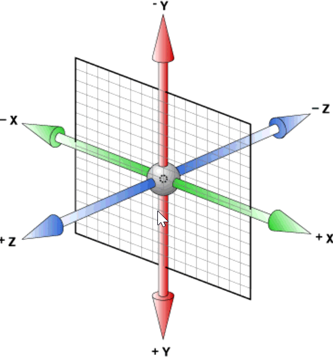
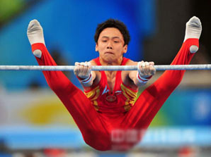
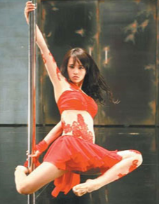

# html5day02
[TOC]

### 三维坐标系
- 二维: 代表一个平面
	- 只有两个轴: X轴和Y轴
- 三维: 代表一个立体
	- 有三个轴: X轴 Y轴 Z轴


总结

1. 如果沿着x轴平移就是水平方向
2. 沿着y轴平移就是垂直方向
3. 沿着z轴平移就是前后方向

### 三维旋转
- x轴为水平方向的轴,  **上下反转**




- y轴为垂直方向的轴   **左右旋转**




- z轴为前后方向的轴(理解为眼睛到屏幕的轴) **顺时针或逆时针**


总结
1. X轴：左右方向
2. Y轴：上下方向
3. Z轴：前后方向


### transform的视距perspective
模拟一个镜头排出物体的变化在展示到屏幕上(三维透视)

如果需要代码中的三维变换能有一些效果,那么就需要加视距(视觉距离)属性才能有比较好的立体效果
近大远小
`transform: perspective('视距值');`

浏览器默认没有开启(3D效果)需手动
`transform-style: preserve-3d;`


代码块
```htmlbars
<!DOCTYPE html>
<html lang="en">


<!-- 

    为了更好的3D效果，一个视距就够了

    视距加在父盒子上会效果更好

    但是注意：加在父盒子上，不要用transform来加，用perspective直接加

 -->

<head>
    <meta charset="UTF-8">
    <meta name="viewport" content="width=device-width, initial-scale=1.0">
    <meta http-equiv="X-UA-Compatible" content="ie=edge">
    <title>Document</title>

    <style>
        ul {
            list-style: none;
            padding: 0;
            width: 600px;
            height: 200px;
            border: 1px solid #000;
            margin: 50px auto;
        }

        li {
            width: 180px;
            height: 180px;
            background-color: yellowgreen;
            float: left;
            margin-left: 15px;
            margin-top: 10px;
            transition: all 1s;
        }
        
        /* 第一个ul是视距加在每个li身上 */
        ul:first-child li{

            transform: perspective(500px);
        }

        ul:first-child:hover li{

            transform: perspective(500px) rotateY(90deg)
        }


        /* 把视距不加在每个li身上，而只是父盒子身上（也就是加在UL上） */
        ul:last-child{

            /* 如果视距加在父盒子身上，那么不能用transform给，而应该直接复制perspetive属性 */  
            perspective: 500px;
        }

        ul:last-child:hover li{

            transform: rotateY(90deg);
        }

    </style>
</head>

<body>
    <ul>
        <li></li>
        <li></li>
        <li></li>
    </ul>

    <ul>
        <li></li>
        <li></li>
        <li></li>
    </ul>
</body>

</html>
```

注意:
默认情况下，消失点位于元素的中心，但是可以通过设置perspective-origin属性来改变其位置。

- 视距加载父元素和子元素的区别
	- 为了更好的3D效果,一个视距就够了
	- 视距加在父盒子上效果会更好
	- 注意: 加载父盒子上,不要用transform来加,用perspective


总结
1. 近大远小的效果,越近效果越明显
2. 3D开发是视距一定要加载不动的父元素上,才能看到上帝视角,小技巧:一个一个往上加
3. 浏览器默认没有开起3D效果(看3D效果必须开启)
`transform-style: preserve-3d;`


### animation
> 是CSS3中的一个属性,要用之前,需要先制定一个动画剧本

使用transition做动画的缺点
1. 无法自动启动
2. 不能设置次数


animation动画剧本
```htmlbars
		@keyframes swimming{
           from{}
           to{
               background-position-y: -1386px;
           }
       }
```


animation
1. 参数1: 动画名
2. 参数2: 动画的持续时间
3. 参数3: 延迟时间
4. 参数4: 动画次数
5. 参数5: 动画效果
6. 参数6: 是否保持动画最终效果,默认是恢复原状,**forwards**是不恢复原状
7. 参数7: 动画方向,:
	8. normal默认值,
	9. reverse: 瞬间先变成最终动画效果,然后再还原动画效果
	10.  **alernate** 从初始样子到动画的最终效果,然后放回初始效果,
8. 参数8: 是否暂停动画,默认值`running`,暂停paused**paused**暂停

`animation: play 2s infinite alternate;`

```htmlbars
<!DOCTYPE html>
<html lang="en">

<head>
    <meta charset="UTF-8">
    <meta name="viewport" content="width=device-width, initial-scale=1.0">
    <meta http-equiv="X-UA-Compatible" content="ie=edge">
    <title>Document</title>

    <style>
        .box {
            width: 100px;
            height: 100px;
            background-color: red;
            /* 
                参数1：动画名
                参数2：动画的持续时间
                参数3：延迟时间
                参数4：动画次数 可以写具体的数字，也可以写infinite，代表无限次
                参数5：动画效果 ease,ease-in,linear,steps
                
                参数6：是否要保持为动画最终效果，默认是恢复原状，不想恢复原状，就写一个forwards
                参数7：动画方向：  normal是默认值： 就是从元素本身的样子用动画效果变成动画最终的样子
                                  reverse：瞬间先变成动画最终样子，然后用动画效果恢复成默认样子
                                  alernate：从初始样子用动画效果变成动画的最终样子，并且又用动画效果返回成最初样子
                                     要用的话，最多只用alernate
                                  alternate-reverse：跟上面相反
                参数8：一般不会用，要用也只是单独使用
                        是继续动画，还是暂停动画
                            running：运行动画默认值
                            paused：暂停动画

                臣妾记不住顺序啊！写100次，就记住了
                第二：顺序随便乱写！都可以用
                    但是有两个时间，写在前面一定是动画持续时间，写在后面的一定是延迟时间
            */
            /* animation: scale 1s infinite  linear forwards alternate; */

            /* animation:  alternate 1s infinite scale forwards linear ; */

            animation:scale 2s infinite alternate;
        }

        .box:hover{

            /* 暂停动画 */
            animation-play-state: paused;
        }

      

        @keyframes scale {

            from {}

            to {
                width: 300px;
                height: 300px;
            }
        }
    </style>
</head>

<body>
    <div class="box"></div>
</body>

</html>
```


注意
不用注意animation的书写顺序,但是有两个关于时间的参数,写在前面是持续时间,后面的是延迟时间

- animation的from
设置动画的初始状态,动画开始的时候会瞬间变成这里写的样子,在开始动画

animation如果有多个动画 用都好隔开,除了transform用空格隔开